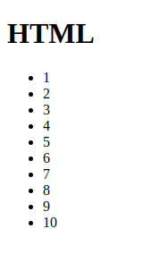

https://start.ktor.io/#/final?name=ktor-sample&website=example.com&artifact=com.example.ktor-sample&kotlinVersion=1.9.22&ktorVersion=2.3.7&buildSystem=GRADLE_KTS&engine=NETTY&configurationIn=CODE&addSampleCode=true&plugins=routing%2Chtml-dsl%2Ccontent-negotiation%2Cktor-jackson

Запуск:<br/>
````shell
chmod +x gradlew
./gradlew build
./gradlew run
````

Ручные тесты:<br/>

````shell
~/prog/kotlin/ktor/ktor-shop$ http  :8080/
HTTP/1.1 200 OK
Connection: keep-alive
Content-Length: 12
Content-Type: text/plain; charset=UTF-8

Hello World!
````

````shell
ktor-shop$ http :8080/json/jackson
HTTP/1.1 200 OK
Connection: keep-alive
Content-Type: application/json
transfer-encoding: chunked

{
"hello": "world"
}
````

````shell
ktor-shop$ http :8080/html-dsl
HTTP/1.1 200 OK
Connection: keep-alive
Content-Length: 258
Content-Type: text/html; charset=UTF-8

<!DOCTYPE html>
<html>
  <body>
    <h1>HTML</h1>
    <ul>
      <li>1</li>
      <li>2</li>
      <li>3</li>
      <li>4</li>
      <li>5</li>
      <li>6</li>
      <li>7</li>
      <li>8</li>
      <li>9</li>
      <li>10</li>
    </ul>
  </body>
</html>
````

